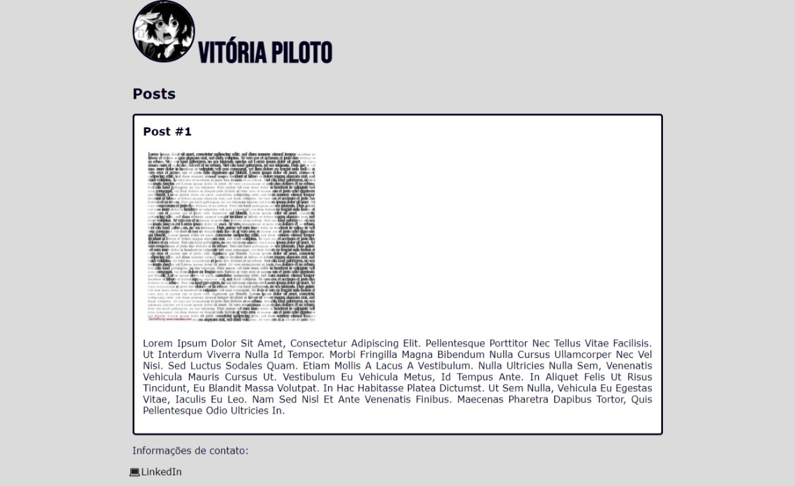

# Box model no css

### Trabalhando e aprendendo com box model no CSS 

**Comandos utilizados:**

- Margin: auto; ➡️ Para alinhar tudo ao centro, de forma responsiva
- Display: inline; ➡️ Para alinhar imagem e texto do primeiro header lado-a-lado
- Border-radius: 50%; ➡️ Para transformar elementos quadrados em círculo
- List-style-type: emoji; ➡️ Para o elemento da lista ser um emoji 
